# E-Library Sistem Informasi Rental Buku Digital
## NAMA: Albhani Fadillah Haryady
## NIM: 312410130

UAS Pemrograman Web 2 Tema: Sistem Informasi Rental Buku / Komik Digital (E-Library)

## Deskripsi Proyek

E-Library adalah aplikasi web untuk mengelola sistem rental buku dan komik digital secara online. Aplikasi ini memungkinkan administrator untuk mengelola data buku, kategori, anggota, dan transaksi peminjaman, sementara pengunjung publik dapat melihat ringkasan informasi perpustakaan tanpa perlu login.

Aplikasi dibangun menggunakan **Decoupled Architecture**, yaitu backend dan frontend benar-benar terpisah dan saling berkomunikasi murni melalui RESTful API.
## Struktur Folder Repository

```

├── backend-api/
│   ├── app/
│   │   ├── Controllers/
│   │   │   ├── Home.php
│   │   │   └── Api/
│   │   │       ├── Auth.php
│   │   │       ├── Buku.php
│   │   │       ├── Kategori.php
│   │   │       ├── Anggota.php
│   │   │       ├── Peminjaman.php
│   │   │       └── Statistik.php
│   │   ├── Models/
│   │   │   ├── UserModel.php
│   │   │   ├── KategoriModel.php
│   │   │   ├── BukuModel.php
│   │   │   ├── AnggotaModel.php
│   │   │   └── PeminjamanModel.php
│   │   ├── Filters/
│   │   │   ├── ApiAuthFilter.php
│   │   │   └── CorsFilter.php
│   │   └── Config/
│   │       ├── Routes.php
│   │       └── Filters.php
│   └── lab11_ci_database.sql
└── frontend-spa/
    ├── index.html
    ├── app.js
    └── components/
        ├── Login.js
        ├── Home.js
        ├── AppShell.js
        ├── Dashboard.js
        ├── Buku.js
        ├── Kategori.js
        ├── Anggota.js
        └── Peminjaman.js
```
## Teknologi yang Digunakan

| Komponen | Teknologi |
|---|---|
| Backend | PHP CodeIgniter 4 (RESTful API, Resource Controller) |
| Frontend | VueJS 3 + Vue Router (Single Page Application, via CDN) |
| UI Framework | TailwindCSS (via CDN) |
| HTTP Client | Axios |
| Database | MySQL / MariaDB |
| Keamanan | Bearer Token Authentication, CORS Filter, Navigation Guard |

## Skema Relasi Tabel Database

Database terdiri dari 5 tabel yang saling berelasi: `user`, `kategori`, `buku` (berelasi ke `kategori`), `anggota`, dan `peminjaman` (berelasi ke `anggota` dan `buku`).

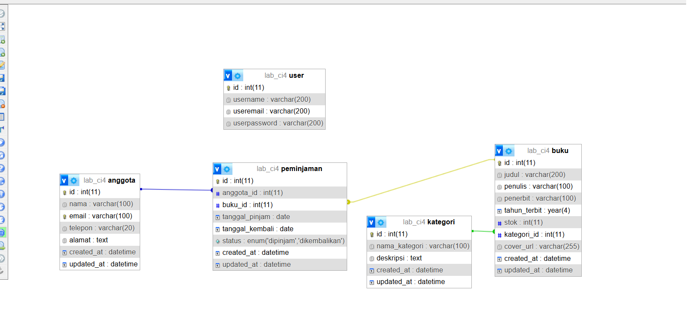

## Bukti Keamanan API (Error 401)

Berikut adalah hasil pengujian endpoint yang dilindungi token, dilakukan melalui Postman tanpa menyertakan Bearer Token pada header `Authorization`. Server menolak request dan mengembalikan status `401 Unauthorized`.

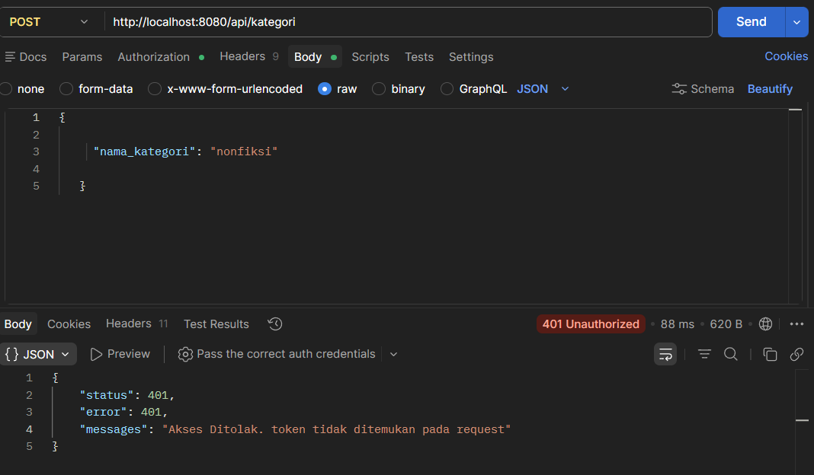

## Screenshot Antarmuka Aplikasi

### Halaman Login
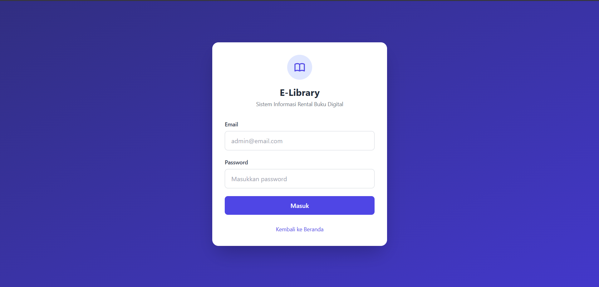

### Dashboard Admin
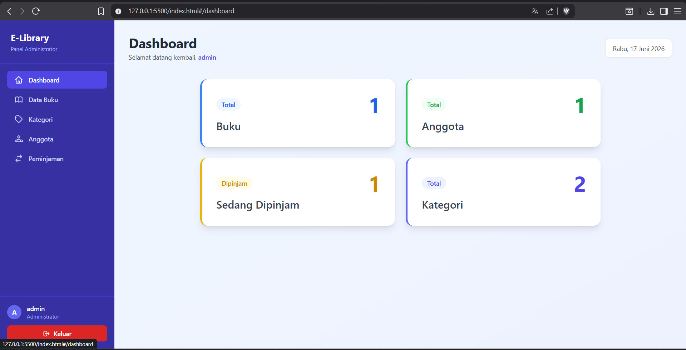

### Form Modal Tambah/Edit Data
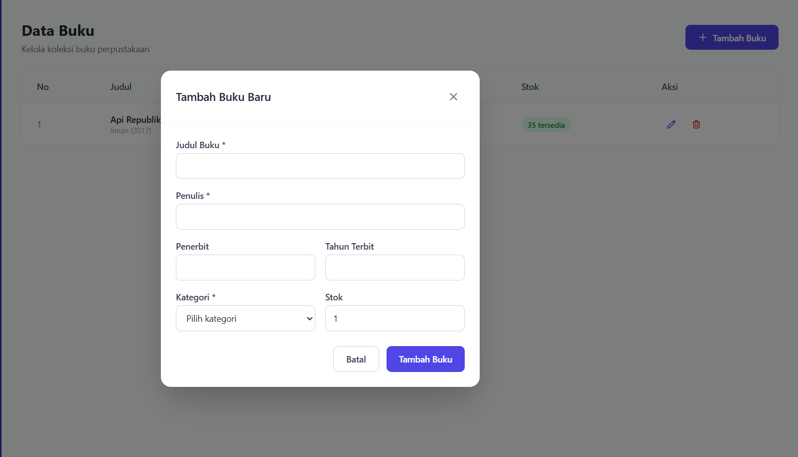
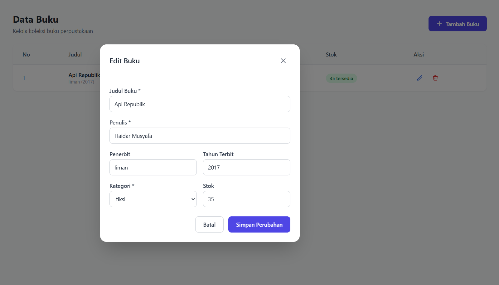
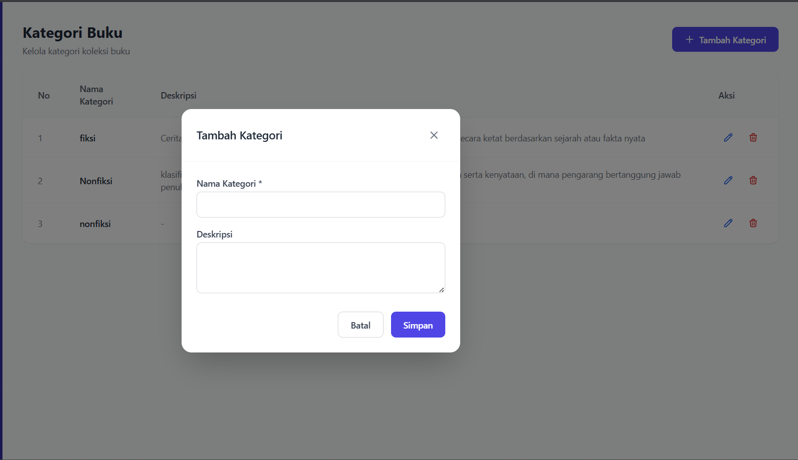
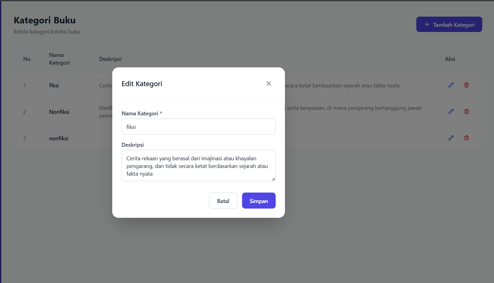
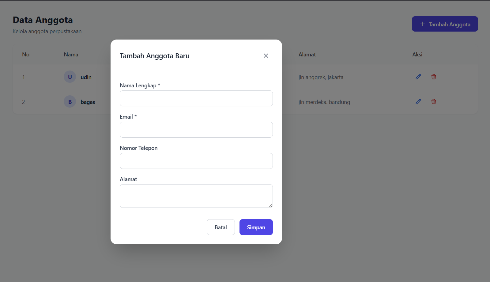
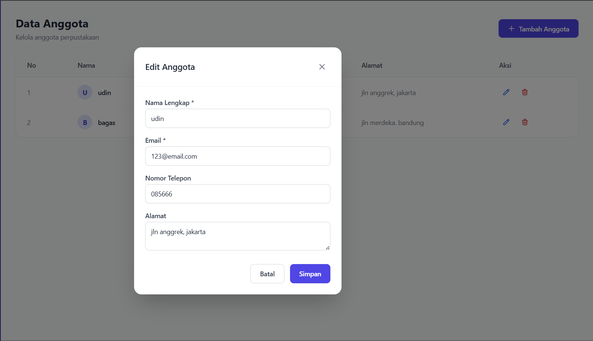
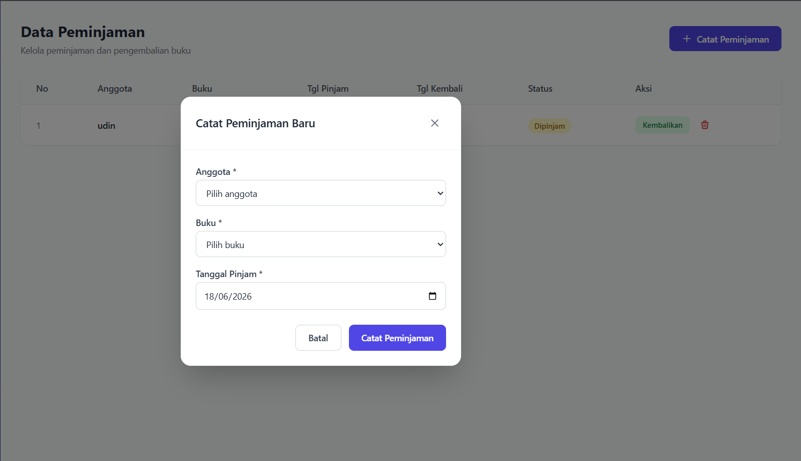
### Tabel Data dengan TailwindCSS

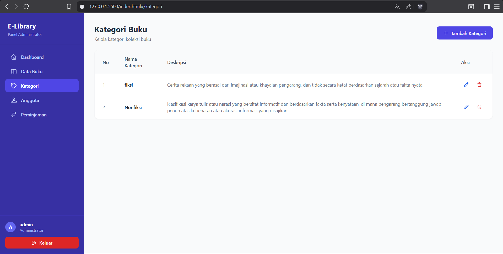

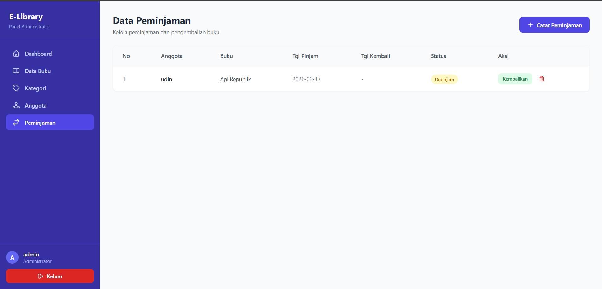

## Cara Instalasi dan Menjalankan Proyek

### Backend (CodeIgniter 4)

1. Pastikan PHP, Apache, dan MySQL sudah aktif (misalnya melalui XAMPP).
2. Import database dengan mengimpor file `lab11_ci_database.sql` melalui phpMyAdmin. File ini akan otomatis membuat database `lab_ci4` beserta seluruh tabel dan data awal.
3. Periksa konfigurasi koneksi database pada file `.env`, sesuaikan jika diperlukan:
   ```
   database.default.hostname = localhost
   database.default.database = lab_ci4
   database.default.username = root
   database.default.password =
   ```
4. Jalankan server backend melalui terminal pada folder `ci4/`:
   ```
   php spark serve
   ```
5. Backend akan berjalan pada alamat `http://localhost:8080`.

### Frontend (VueJS SPA)

1. Buka folder `frontend-spa/` menggunakan VSCode.
2. Periksa konfigurasi `BASE_URL` pada file `app.js`, pastikan sesuai dengan alamat backend:
   ```javascript
   const BASE_URL = 'http://localhost:8080';
   ```
3. Jalankan file `index.html` menggunakan ekstensi Live Server pada VSCode (klik kanan `index.html` lalu pilih **Open with Live Server**).
4. Frontend akan terbuka pada alamat seperti `http://127.0.0.1:5500`.

### Akun Login Default

| Email | Password |
|---|---|
| admin@email.com | admin123 |

## Link Demo dan Video Presentasi

- **Link Demo**: 
- **Link Video Presentasi**: 

